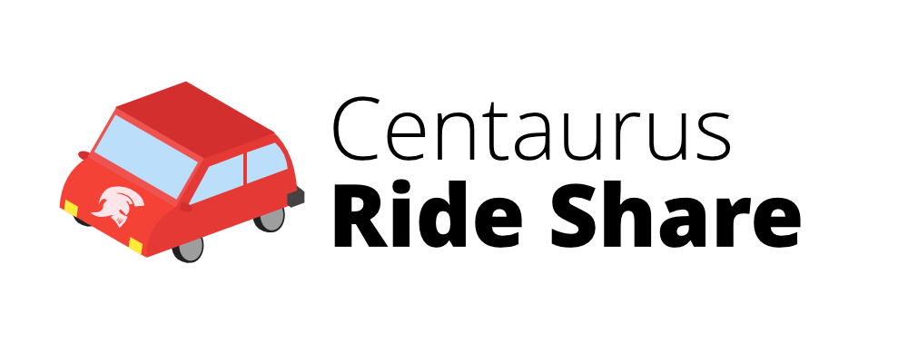

# 

*The website software for the Centaurus High School Ride Share program*

# Running
The software can be started on `localhost:8000` or `127.0.0.1:8000` by executing `run.py`

This will start the local Flask server. *The software is currently not configured to run on a webserver like Nginx.*

```  
$ cd <path to software root>/run.py
$ python run.py
```

You need to create the database before running this software with `$ python db_create.py`. This only needs to be done once.

## Virtual Environment

`/chsrideshare` is a Python virtual environment with all the dependencies installed. The software can be run with the virtual env on GNU+Linux/UNIX following these steps:

1. Navigate to Product directory in the command line `$ cd <path to software root>`

2. Run `$ chsrideshare/bin/python db_create.py` in the command line

3. Run `$ chsrideshare/bin/python run.py` in the command line
